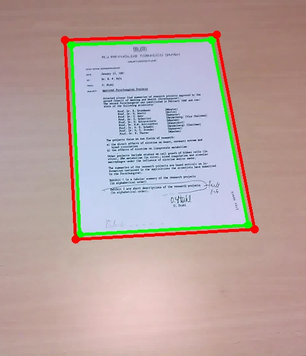
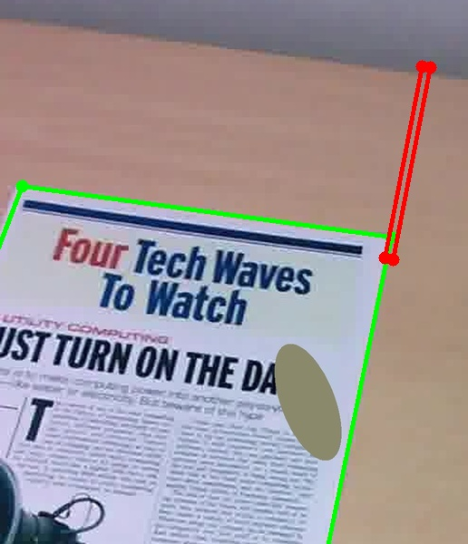
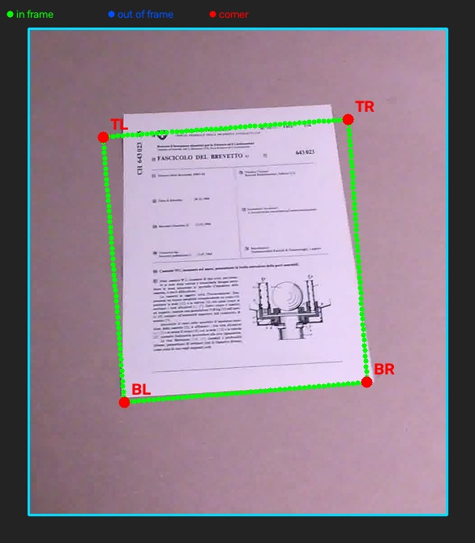
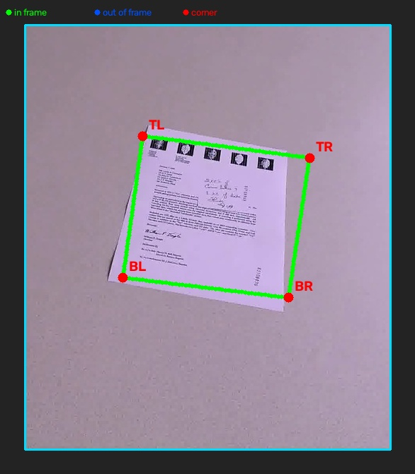
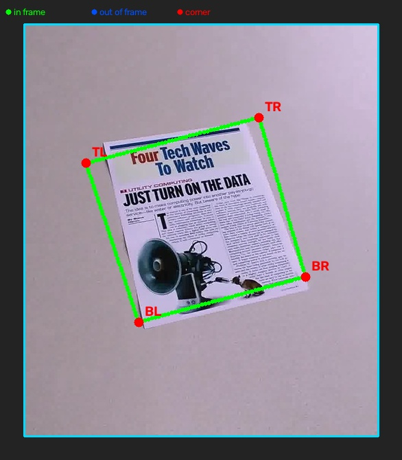
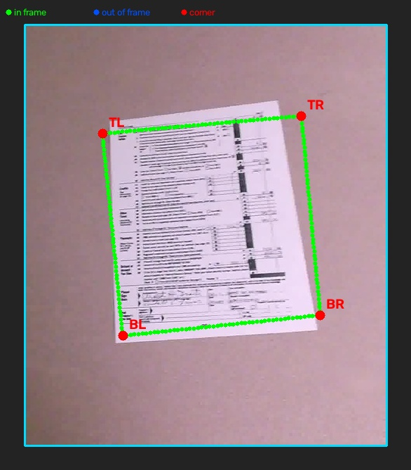
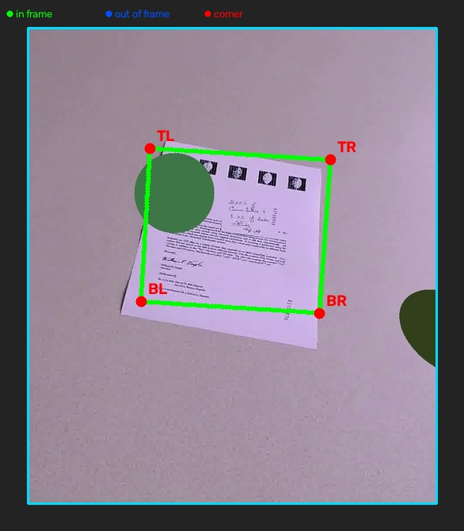
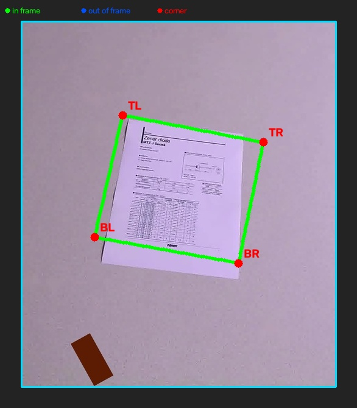
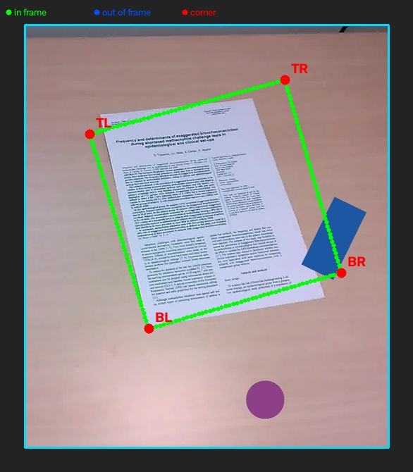
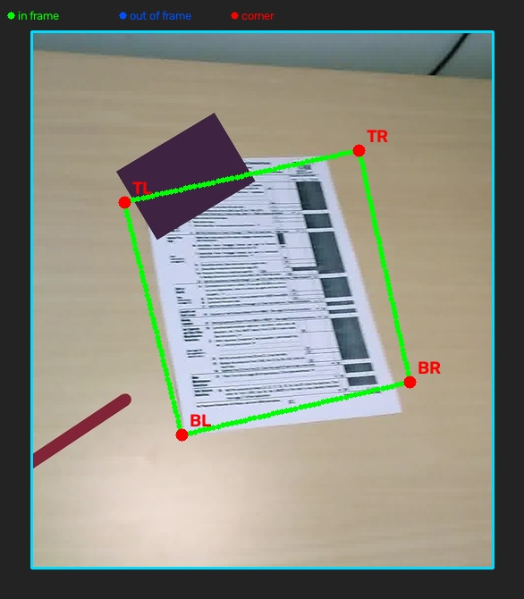

# Определение границ листа и устранение искажений перспективы

В данном проекте рассматривается задача определения границ листа бумаги на фотографии и последующего устранения искажений перспективы. Реализованы два способа решения задачи: классический алгоритм обработки изображений и нейросетевая модель на основе ResNet50.

На вход программы подается фотография, на которой лист может находиться под углом, частично выходить за границы кадра или перекрываться посторонними объектами. Результатом работы являются найденные координаты границ листа и изображение, выровненное с помощью перспективного преобразования.

## Классический подход

Классический алгоритм состоит из следующих этапов:

1. Изображение переводится в оттенки серого.
2. Применяется размытие для уменьшения количества мелких границ.
3. Выполняется адаптивная бинаризация и морфологическое закрытие.
4. С помощью детектора Canny выделяются границы объектов.
5. Преобразование Хафа используется для поиска прямых линий.
6. Из найденных отрезков выбираются два основных направления.
7. По точкам пересечения четырех выбранных линий рассчитываются углы листа.

После определения углов строится матрица гомографии и выполняется перспективное преобразование изображения.

Данный подход не требует обучения и достаточно быстро работает на изображениях с хорошо различимыми границами листа. При наличии текста, теней, краев стола и других прямых линий преобразование Хафа может выбрать не те границы. Поэтому классический алгоритм отдельно проверяется на фотографиях с посторонними объектами и без них.

## Нейросетевой подход

В нейросетевом подходе используется предобученная ResNet50 без классифицирующей части. Параметр `pooling=None` позволяет сохранить карту признаков размером `7 × 7`, чтобы после ResNet50 оставалась информация о расположении частей изображения.

Перед подачей в модель фотография переводится в оттенки серого и обрабатывается адаптивной бинаризацией. Размер изображения изменяется с сохранением пропорций, после чего недостающая область заполняется белым цветом. Полученный холст имеет размер `512 × 683`, а непосредственно перед ResNet50 уменьшается до `224 × 224`.

Модель предсказывает не только четыре угла, а полный контур листа. Контур состоит из 200 упорядоченных точек: по 50 точек для каждой стороны. Для каждой точки дополнительно определяется вероятность ее нахождения внутри кадра.

После предсказания координаты переводятся из системы координат холста обратно в систему координат исходной фотографии. По всем точкам каждой стороны строится прямая. Пересечения четырех прямых используются в качестве углов листа для перспективного преобразования.

Обучение проводится в два этапа. Сначала ResNet50 остается замороженной и обучаются только добавленные слои. Затем размораживается последний блок `conv5`, кроме слоев Batch Normalization, и обучение продолжается с меньшей скоростью.

## Генерация обучающих изображений

Для обучения нейросетевой модели был реализован генератор синтетического датасета. По умолчанию создается 100 000 изображений вместе с координатами четырех углов листа.

При генерации задаются следующие варианты:

- 50% листов полностью находятся в кадре;
- 20% имеют один угол за границей изображения;
- 30% имеют два угла за границей изображения;
- 15% листов имеют маленький размер, 25% средний и 60% большой;
- половина изображений содержит посторонние объекты;
- создаются вертикальные, квадратные и горизонтальные изображения;
- используются вертикальные и горизонтальные положения листа;
- обычная, сильная и предельная перспектива встречаются примерно поровну;
- часть листов остается пустой, на остальных добавляются текст, линии и прямоугольные области.

На фон и лист также добавляются неравномерное освещение, тени, блики, шум, размытие и JPEG-сжатие. В качестве посторонних объектов используются окружности, прямоугольники, провода, телефон, книга, второй лист и прямоугольная упаковка. Такие объекты нужны для того, чтобы наиболее заметный прямоугольник на фотографии не всегда являлся искомым листом.

## Оценка результатов

Для проверки используется набор, состоящий из изображений без посторонних объектов и с посторонними объектами. Оба подхода проверяются на одних и тех же изображениях.

Используются следующие показатели:

- `Detection rate` показывает долю изображений, для которых были получены четыре угла;
- ошибка углов показывает среднее расстояние между найденными и размеченными углами в пикселях;
- `LPIPS` оценивает отличие исправленного изображения от эталонного, меньшее значение является лучшим;
- `SIFT ratio` показывает долю совпавших локальных признаков, большее значение является лучшим.

Получены следующие результаты:

| Подход | Условия | Найдено | Detection rate | Ошибка углов, px | LPIPS | SIFT ratio |
|---|---|---:|---:|---:|---:|---:|
| Классический | Без объектов | 21 / 49 | 42.9% | 136.2 | 0.555 | 0.322 |
| Классический | С объектами | 22 / 60 | 36.7% | 132.2 | 0.528 | 0.388 |
| Нейросетевой | Без объектов | 49 / 49 | 100% | 68.9 | 0.508 | 0.462 |
| Нейросетевой | С объектами | 60 / 60 | 100% | 74.1 | 0.531 | 0.490 |

Для классического подхода ошибка углов, LPIPS и SIFT рассчитываются только для тех изображений, на которых удалось получить четыре угла. Поэтому данные значения необходимо рассматривать вместе с показателем Detection rate.

На данном тестовом наборе нейросетевая модель обработала все изображения. Средняя ошибка углов составила от 68.9 до 74.1 пикселя. Это лучше результата классического алгоритма, однако такая ошибка все еще заметна на части фотографий.

## Примеры работы

### Классический алгоритм без посторонних объектов

На простой сцене алгоритм определил лист достаточно точно: средняя ошибка четырех углов составила 12.4 пикселя. Зеленым показана правильная разметка, красным — найденные углы.

### Классический алгоритм с посторонним объектом

На этом изображении часть листа закрыта посторонним объектом. Преобразование Хафа выбрало неподходящие линии, поэтому красный контур сильно отличается от правильной зеленой разметки. Ошибка углов составила 483.0 пикселя.

### Нейросетевая модель без посторонних объектов

| | |
|---|---|
|  |  |
| Ошибка углов: 20.6 px | Ошибка углов: 23.3 px |
|  |  |
| Ошибка углов: 23.5 px | Ошибка углов: 24.4 px |

### Нейросетевая модель с посторонними объектами

| | |
|---|---|
|  |  |
| Ошибка углов: 29.0 px | Ошибка углов: 29.7 px |
|  |  |
| Ошибка углов: 31.6 px | Ошибка углов: 32.2 px |

На изображениях нейросетевого подхода зеленым обозначены видимые точки контура, синим — точки, которые модель считает находящимися за пределами кадра, красным — рассчитанные углы листа.

## Ограничения

Классический алгоритм чувствителен к посторонним прямым линиям и предполагает, что два основных направления границ расположены приблизительно перпендикулярно. При сильном перспективном искажении данное условие выполняется не всегда.

Основная часть нейросетевой модели обучается на сгенерированных изображениях. Несмотря на добавление различных фонов, объектов и искажений, синтетические изображения отличаются от реальных фотографий. Это остается одной из основных причин ошибки модели.

Точки обучающего контура строятся по прямым между четырьмя углами. По этой причине модель определяет геометрический контур листа, но не восстанавливает реальные изгибы мятой или загнутой бумаги.
